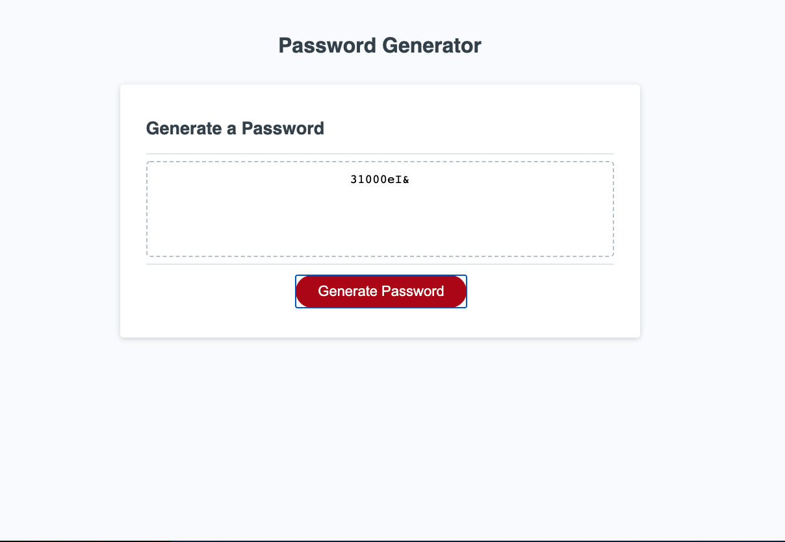

# Password Generator
The purpose of the Password Generator is to create random passwords to protect sensitive data. The program generates random character types between 8 and 128 characters long.
When the user clicks the "generate a password" button, they are prompted with a series of questions and based on their response, a password will be generated in the display.

# Built With
* HTML
* CSS
* Java Script
 
 1. Added prompts within the generatePassword function so they are prompted with the following questions:
      1. Please enter the number of characters. Must be no less than 8 and no more than 128.      
      2. Do you want special characters in your password?      
      3. Do you want numbers in your password?
      4. Do you want lowercases in your password?
      5. Do you want uppercases in your password?
 2. Created variable functions that generate number/character using math objects.
 3. Added if statements that responds by inputting the requested number/character into the password.
 4. Used a loop expression to get random characters.

    
[URL of deployment](https://chrispruiz.github.io/Password_Generator/)

[GitHub Repository Link](https://github.com/Chrispruiz/Password_Generator.git)

